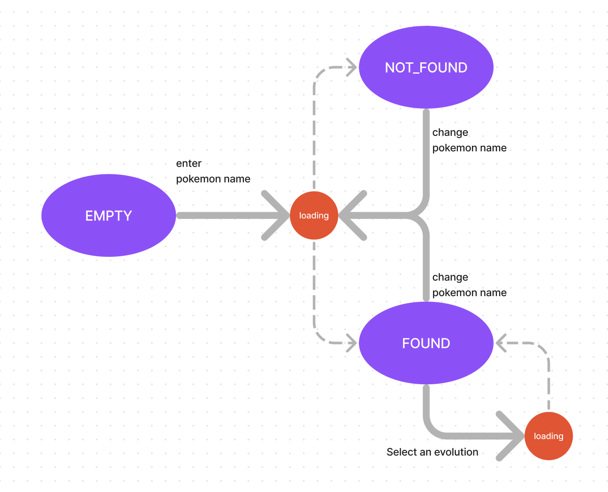
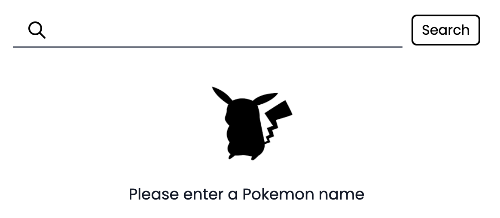
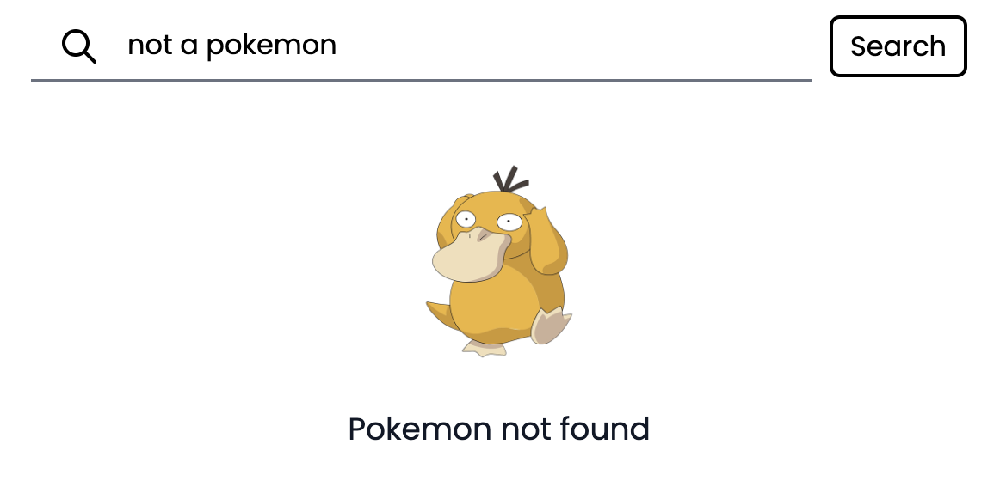
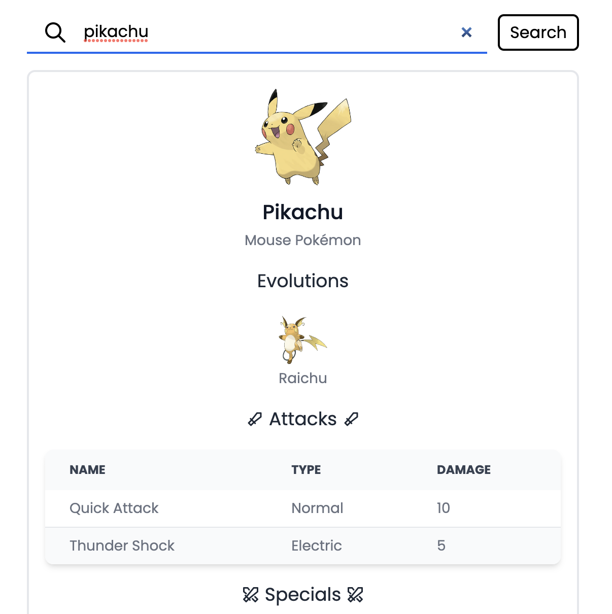
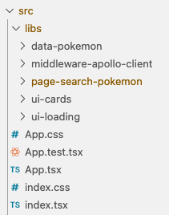

# Pokemon Search

A CRA app for practicing front-end development.

# Tech Stack

1. React (create-react-app)
2. Storybook
3. graphql-codegen
4. Tailwind (Flowbite)
5. Pokemon Graphql API

# Getting Started

1. Clone the source code: `git clone git@github.com:asinkxcoswt/search-pokemon.git`
2. Install dependencies: `cd search-pokemon; yarn install`
3. Generate Graphql client: `yarn gen`
4. Run the unit tests: `yarn test`
5. Run the Storybook: `yarn storybook`, and open `http://localhost:6006/` in your browser.
6. Run the app: `yarn start`, and open `http://localhost:3000/` in your browser.

# Application State Diagram

## Empty

## NOT_FOUND

## FOUND

# Code Architecture

The structure is inspired by [NX](https://nx.dev/structure/library-types).

## Library Types

1. **data**: contain hooks and interfaces responsible for talking with the back-end
2. **middleware**: contain components that provide backbone functions (through React Context API) for the entire app. In this case we have only 1 middleware `middleware-apollo-client` to provide the set up for the Apollo graphql client.
3. **ui**: contain dump UI components. They will not have access to data other than what are supplied through the props.
4. **page**: represent a page in the app. AKA the 'P' in MVP architecture.f It wires up everything to provide a useful feature for the app.

## Library Dependency

**page** can depend on

- ui
- data
- middleware

**data** can depend on

- middleware

**middleware** can depend on

- ui

**ui** cannot depend on other library

# Code Generation

We use `@graphql-codgen` to generate the typescript function to connect with the Graphql back-end.

1. Define the desired graphql operation in `data-***` module, see example in `src/libs/data-pokemon/operations.graphql`

2. Edit `codegen.yml` to include the file.
3. Run `yarn gen`
4. The generated file will be placed in `src/libs/data-***/gen/generated.tsx`
5. It is recommended to encapsulate the generated code within the data module, by create a wrapper function that accounts for specific use cases and export it from `index.ts`, see `src/libs/data-pokemon/queries`.
6. Create jest `__mocks__` inside the `gen` directory and provide a mock implementation so that we can run the test without calling the external API.

# Unit Testing

In this architecture, we can write as many tests as we want by creating the `***.text.ts(x)` file together with any function or component.

But the test for each page is mandatory. Inside a page module (`page-***`), there should be `***Page.tsx` and `***Page.test.tsx`.

And for the app to be independently testable, every `data-***` module should provide the `__mocks__` implementations for any function talking to the external environment.

# Storybook

Every TSX component `***.tsx` should have the corresponding story file `***.stories.tsx`, in which should contain at least 1 story, see `src/libs/page-search-pokemon/components/PokemonSearchCardInfo/PokemonSearchCardInfo.stories.tsx` for an example.
